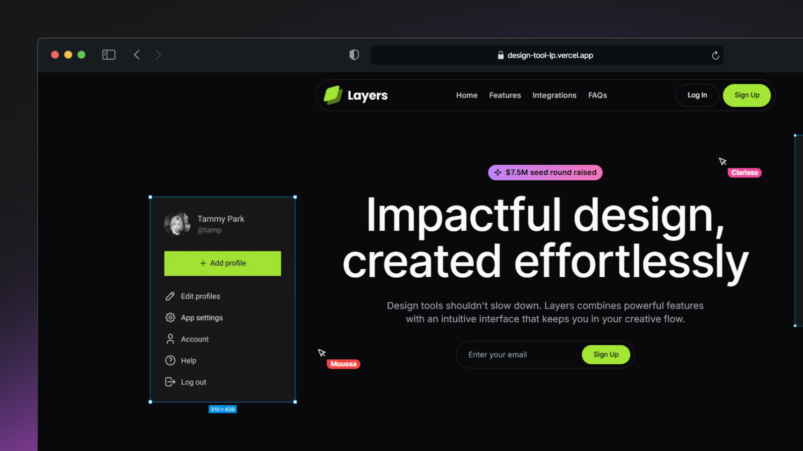

# Design Tool Landing Page

A stunning dark-mode landing page featuring a sleek, modern design and a highly responsive interface. Built with cutting-edge technologies and optimized for seamless performance.

Developed with **Next.js 15**, **Tailwind CSS**, **Framer Motion**, and **Shadcn UI**, this project showcases a collection of fully reusable components, including the collaborative **Pointer** component.

## How to run this project ?
To run this project on your local environment, follow the following steps :
- Clone the repository to your local machine or download the source code.
- Run the command `npm install` or `pnpm install` in the project directory to install the **required** dependencies
- Run the command `npm run start` or `pnpm run start` to start the `production build` of the project.
- Open your internet browser and go to the following address: [http://localhost:3000](http://localhost:3000)
